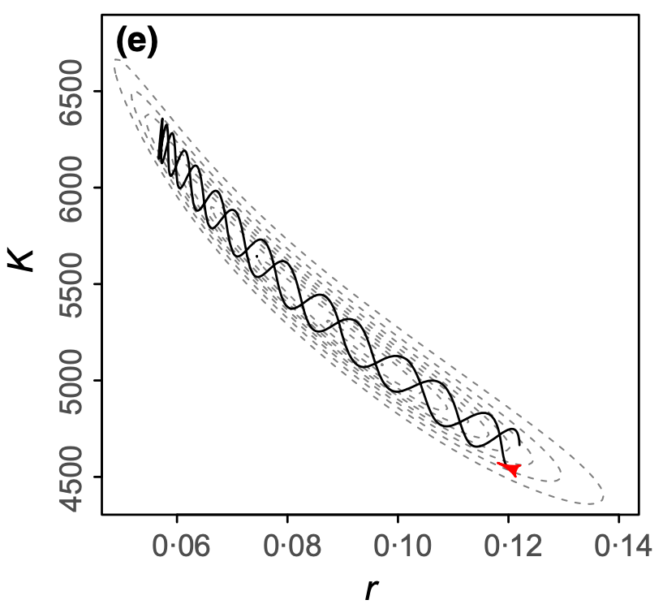
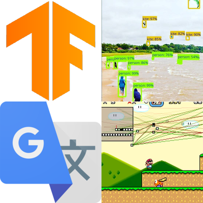
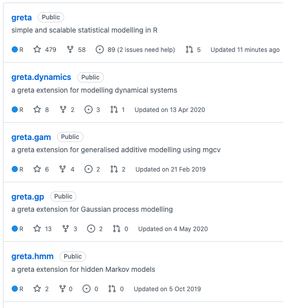
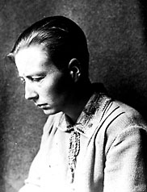
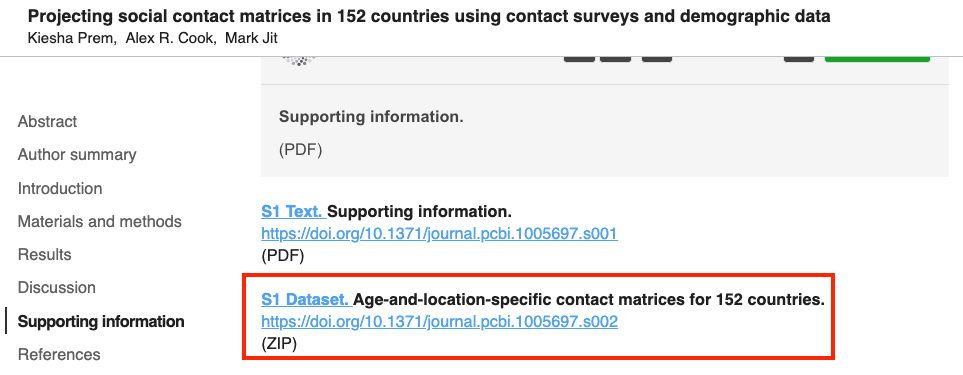
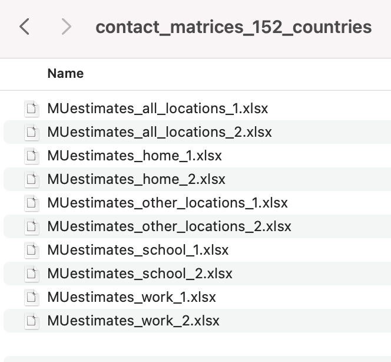
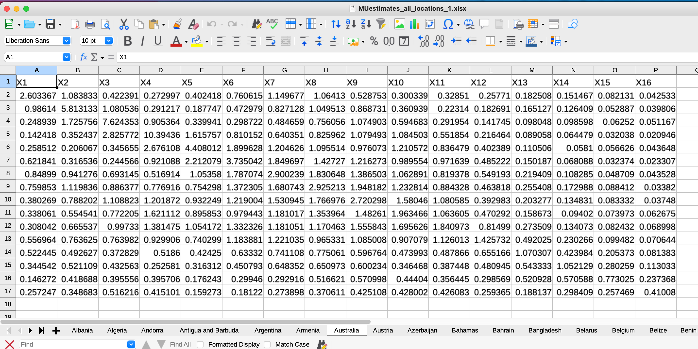

```{r setup, include=FALSE}
# options(htmltools.dir.version = FALSE, width = 120)
# NOTE TO SELF: The CSS styles were created in `create-njt-theme.R`
library(modelr)
library(tidyverse)
library(visdat)
library(naniar)
library(gganimate)
library(knitr)
library(ggrepel)
library(lme4)
library(broom)
library(brolgar)
heights <- brolgar::heights
opts_chunk$set(
  fig.path = "figures/",
  cache.path = "cache/",
  fig.align = "center",
  fig.width = 13,
  fig.height = 6,
  fig.retina = 3,
  out.width = "90%",
  fig.show = "hold",
  external = TRUE,
  # dev = "svglite",
  # dev.args = list(bg = "transparent"),
  message = FALSE,
  warning = FALSE,
  cache = TRUE,
  echo = FALSE,
  autodep = TRUE
)

as_table <- function(...) kable(..., format='html', digits = 3)

theme_set(
  theme_grey(base_size = 16) +
  theme(
    legend.position = "bottom",
    plot.background = element_rect(fill = "transparent"),
    legend.background = element_rect(fill = "transparent")
  )
)

heights <- heights %>% 
  add_n_obs() %>% 
  filter(n_obs > 1) %>% 
  select(- n_obs,
         - continent)

example <- heights %>%
  filter(country == "Australia",
         year >= 1910) %>% 
  mutate(height_cm = round(height_cm))

# **ni**ck's **pa**lette
nipa <- list(red = "#c03018",
             orange = "#f0a800",
             green = "#609048",
             purple = "#484878",
             light_purple = "#A3A3BB",
             light_green = "#AFC7A3",
             light_orange = "#F7D37F",
             light_red = "#DF978B",
             pale_purple = "#ECECF1",
             pale_green = "#D7E3D1",
             pale_orange = "#FBE9BF",
             pale_red = "#EFCBC4")

```

```{r fun-heights-appear}
anim_height_appear <- function(){
  anim <- ggplot(heights,
                 aes(x = year,
                     y = height_cm,
                     group = country)) + 
    geom_line() + 
    transition_manual(country, cumulative = TRUE) + 
    ease_aes("exponential")
  animate(anim, fps = 24)
}
```

# .large[greta: scalable statistical inference]

<br> <br>

## Nicholas Tierney
## Telethon Kids Institute, Perth, Australia
## QUT EC Seminar, 22nd December, 2021

`r icons::icon_style(icons::fontawesome(name = 'link', 'solid'), fill = nipa$purple)` **njt-qut-ec.netlify.app** 

`r icons::icon_style(icons::fontawesome$brands$twitter, fill = nipa$purple)` **nj_tierney**

---

layout: true
<div class="my-footer"><span>bit.ly/njt-qut-ec • @nj_tierney</span></div> 

---
# The story so far

2008-2012:  Undergraduate + honours in Psychology

--

2013 - 2017: PhD Statistics, QUT

- Exploratory Data Analysis (EDA)
- Bayesian Statistics
- Geospatial statistics / Optimal facility placement

--

2018 - 2020: Research Fellow / Lecturer at Monash

  - Design and improve tools for (exploratory) data analysis
  - Teach introduction to data analysis (ETC1010)

---
    
# EDA: Exploratory Data Analysis

.large[
> ...EDA is an approach to analyzing data sets to summarize their main characteristics, often with visual methods. (Wikipedia)

John Tukey, Frederick Mosteller, Bill Cleveland, Dianne Cook, Heike Hoffman, Rob Hyndman, Hadley Wickham
]

---

# EDA: Why it's worth it

```{r dino-saurus, out.width = "80%"}
include_graphics("gifs/dino-saurus.gif")
```

-- From ["Same Stats, Different Graphs: Generating Datasets with Varied Appearance and Identical Statistics through Simulated Annealing"](https://www.autodeskresearch.com/publications/samestats)

---

## `visdat::vis_dat(airquality)`

```{r show-visdat, fig.height = 3.5, fig.width = 8, out.width = "150%"}
vis_dat(airquality)
```


---

## `naniar::geom_miss_point()`

```{r gg-miss-point, fig.height = 3.5, fig.width = 8, out.width = "150%"}
ggplot(airquality,
       aes(x = Ozone,
           y = Solar.R)) + 
  geom_miss_point()
```

---

## `naniar::gg_miss_var(airquality)`

```{r gg-miss-var, fig.height = 3.5, fig.width = 8, out.width = "150%"}
gg_miss_var(airquality)
```

---

## `naniar::gg_miss_upset(riskfactors)`

```{r gg-miss-upset, fig.height = 3.5, fig.width = 8, out.width = "150%"}
gg_miss_upset(riskfactors)
```


---

## `brolgar` - take spaghetti

```{r gg-brolgar}
ggplot(heights,
       aes(x = year,
           y = height_cm,
           group = country)) + 
  geom_line()
```

---

## `brolgar` - sample spaghetti


```{r gg-brolgar-sample}
ggplot(heights,
       aes(x = year,
           y = height_cm,
           group = country)) + 
  geom_line() + 
  facet_sample()
```


---

## `brolgar` - spread spaghetti


```{r gg-brolgar-spread}
ggplot(heights,
       aes(x = year,
           y = height_cm,
           group = country)) + 
  geom_line() + 
  facet_strata(along = -year)
```

---

# Now

.large[

Research Software Engineer

Working at [Telethon Kids Institute](https://www.telethonkids.org.au/)

With the [Malaria Atlas Project](https://malariaatlas.org/)

]

---

# Define: Research Software Engineer

> A Research Software Engineer (RSE) combines professional software engineering expertise with an intimate understanding of research.

-- (from https://society-rse.org/about/)

---

# What sorts of things does an RSE do?

.large[
- Create software to **solve research problems**
- Develop tools that **abstract the right components** to facilitate research
- Help researchers to **find and learn** good tools
- Support researchers with (computational) reproducibility
]

(adapted from Heidi Seibold's [UseR2021 Keynote talk](https://docs.google.com/presentation/d/1XQc2U2X8hiK43UzUi9IwvsvULxhVy0WzWSa_Kt4ZJv4/view#slide=id.gdbfb32d486_0_448))

---
background-image: url("imgs/greta-logo-background.png")
background-size: contain
class: center, bottom

.pull-left[
Professor Nick Golding
]

.pull-right[
[greta-stats.org](https://www.greta-stats.org)
]

---
.pull-left[
## stan

.vsmall[
```
data {
  real alpha;
  real beta;
  real<lower=0> sigma2;
  int<lower=0> J;
  array[J] int y;
  vector[J] Z;
  array[J] int n;
}
transformed data {
  real<lower=0> sigma;
  sigma = sqrt(sigma2);
}
parameters {
  real theta1;
  real theta2;
  vector[J] X;
}
model {
  array[J] real p;
  theta1 ~ normal(0, 32); // 32^2 = 1024 
  theta2 ~ normal(0, 32);
  X ~ normal(alpha + beta * Z, sigma);
  y ~ binomial_logit(n, theta1 + theta2 * X);
}
```
]
]

.pull-right[
## JAGS

```
for(j in 1 : J) {
   y[j] ~ dbin(p[j], n[j])
   logit(p[j]) <- theta[1] + theta[2] * X[j]
   X[j] ~ dnorm(mu[j], tau)
   mu[j] <- alpha + beta * Z[j]
}
theta[1] ~ dnorm(0.0, 0.001)
theta[2] ~ dnorm(0.0, 0.001)
```

## greta

```r
theta <- normal(0, 32, dim = 2)
mu <- alpha + beta * Z
X <- normal(mu, sigma)
p <- ilogit(theta[1] + theta[2] * X)
distribution(y) <- binomial(n, p)
```

]

---
# gradient-based inference

```{r show-monnahan, out.width = "45%"}

```

---

# google tensorflow

.pull-left.large[
- automatic differentiation
- efficient linear algebra
- highly parallel
]

.pull-right[
```{r tf-examples}

```

]

---
# extendable

```{r extendable, out.width = "50%"}

```

---

# `greta.gp`


> `greta.gp` extends `greta` to let you define Gaussian processes as part of your model. It provides a syntax to create and combine GP kernels, and use them to define either full rank or sparse Gaussian processes.

.pull-left[

```r
# kernel & GP
kernel <- rbf(rbf_len, rbf_var) + 
            bias(1)
f <- gp(x, kernel)

# likelihood
distribution(y) <- normal(f, obs_sd)

# prediction
f_plot <- project(f, x_plot)
```

]

.pull-right[
```{r extendable-greta-gp}
include_graphics("imgs/greta-extendable-gp.png")
```
]

---

# Recent Changes

.large[
- Easy(er) installation of TensorFlow and Python Dependencies
- Reviewed error messages
- Various bug fixes related to RStudio not detecting python, updates to tensorflow, 
- simulation from priors now available with `calculate`
- See more at the [Changelog for 0.4.0](https://greta-stats.org/news/index.html)
]

---

# What's next?

.large[
- marginalisation (discrete, Laplace, variational)

- discrete samplers

- samplers for big data

- extension packages

- No U Turn Sampler
]

---

# why 'greta' ?

.pull-left[

Grete Hermann (1901 - 1984)

wrote the first algorithms for computer algebra

... without a computer

(To avoid people saying 'greet', the package is spelled _greta_ instead)
]

.pull-right[
```{r show-grete, out.width = "60%"}

```

]

---
# .huge[demo]

---

# Thanks

.large.pull-left[
- Nick Golding
- Miles McBain
]

.large.pull-right[
- Di Cook
- Rob Hyndman
]

---

# Colophon

.large[
- Slides made using [xaringan](https://github.com/yihui/xaringan)
- Extended with [xaringanthemer](https://github.com/gadenbuie/xaringanthemer)
- Colours taken + modified from [lorikeet theme from ochRe](https://github.com/ropenscilabs/ochRe)
- Header font is **Josefin Sans**
- Body text font is **Montserrat**
- Code font is **Fira Mono**
- template available: [njtierney/njt-talks](github.com/njtierney/njt-talks)
]


---

# Bonus round

---

# Example: Malaria modelling

```{r malaria-eg, eval = FALSE}
model <- inlabru::bru(
formula = pr ~ avg_lower_age + Intercept + 
  who_region(month_num, #<<
             model = "ar1", 
             group = .who_region_id, #<<
             constr = FALSE) + 
  who_subregion(month_num,  #<<
                model = "ar1", 
                group = .who_subregion_id, #<<
                constr = FALSE) + 
  country(month_num, #<<
          model = "ar1", 
          group = .country_id, #<<
          constr = FALSE),
    family = "gaussian",
    data = malaria_africa_ts,
    options = list(control.compute = list(config = TRUE),
                   control.predictor = list(compute = TRUE, link = 1))
    )
```

---

# Example: Malaria modelling


```{r show-code, echo = TRUE, eval = FALSE}
cleaned_data <- data %>%
    as_tibble() %>%
    group_by(who_region) %>%
    transmute(.who_region_id = cur_group_id()) %>% #<<
    ungroup(who_region) %>%
    select(-who_region) %>% 
    group_by(who_subregion) %>%
    transmute(.who_subregion_id = cur_group_id()) %>% #<<
    ungroup(who_subregion) %>%
    select(-who_subregion) %>% 
    group_by(country) %>%
    transmute(.country_id = cur_group_id()) %>% #<<
    ungroup(country) %>%
    select(-country) 
```


---

# Example: Malaria modelling

[`yahtsee` (Yet Another Hierarchical Time Series Extension + Expansion)](https://github.com/njtierney/yahtsee)

```{r show-yahtsee, eval = FALSE, echo = TRUE}
m <- fit_hts(
  formula = pr ~ avg_lower_age + 
  hts(who_region, #<<
      who_subregion, #<<
      country), #<<
  .data = malaria_africa_ts,
  family = "gaussian"
)
```

---
# Contact matrices - [Prem et al](https://journals.plos.org/ploscompbiol/article?id=10.1371/journal.pcbi.1005697#sec020)

```{r show-prem-matrix, echo = FALSE, out.width = "40%"}
include_graphics("imgs/prem-age-matrix.png")
```


---

# Contact matrices

.pull-left[
```{r show-prem-matrix-data, echo = FALSE}

```
]

.pull-right[
```{r show-prem-matrix-excel, echo = FALSE}

```

]

---
# Contact matrices

```{r show-prem-matrix-excel-data-oz, echo = FALSE, out.width = "75%"}

```

---
# Contact matrices

```{r show-conmat-matric, echo = FALSE}
include_graphics("imgs/patchwork-contact.png")
```

---

# Contact matrices

- `conmat` (name in progress) package facilitates contact matrix analysis
- Nick Golding contributed statistical modelling
- I implemented package design, infrastructure, tests, documentation
- absolutely critical in recent national covid19 modelling to prime ministers cabinet
- package available on [github](https://github.com/njtierney/conmat)

---

# Developing robust pipelines for rapid analysis

- Working with "Doherty Modelling Group" for Prime Ministers Cabinet
- Ensure codebase stays stable with multiple contributors
- Ensure order of operations stays consistent/easy to comprehend with large amounts of code being written (about 8000 lines of code and 260 functions written from September - October)

--

- Use {targets}, {fnmate}, and {capsule} to capture pipline workflow, rapidly write functions, and lock in package versions
- Example: https://github.com/njtierney/ttiq-simulation

--

What does that look like?

- 11,177 lines of code
- 1,535 tests
- ~705 functions


---

.vhuge[
**End.**
]
